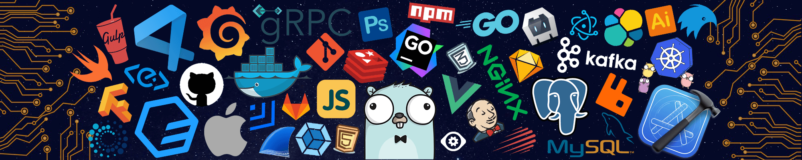
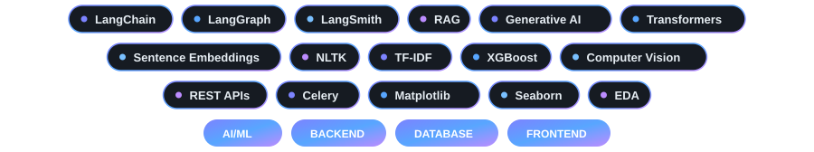
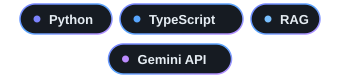
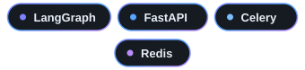
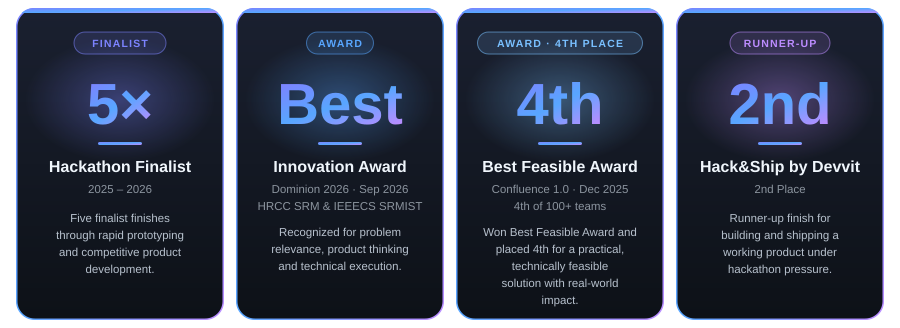

<!-- ========================================================= -->
<!--                           HEADER                          -->
<!-- ========================================================= -->

  

  

  

  
  
  
  

  

<!-- ========================================================= -->
<!--                           ABOUT                            -->
<!-- ========================================================= -->

<h2 align="center">About Me</h2>

  

  
  
  
  
  

  <b>Coursework:</b> Data Structures &amp; Algorithms · Machine Learning · Deep Learning · NLP · Data Analysis

<!-- ========================================================= -->
<!--                        TECHNOLOGY                          -->
<!-- ========================================================= -->

<h2 align="center">Technology</h2>

  

    <nobr>
      
      &nbsp;&nbsp;&nbsp;&nbsp;&nbsp;&nbsp;&nbsp;&nbsp;
      
    </nobr>
  

  

    <nobr>
      
      &nbsp;&nbsp;&nbsp;&nbsp;&nbsp;&nbsp;&nbsp;&nbsp;
      
    </nobr>
  

   
  

    <nobr>
      
      &nbsp;&nbsp;&nbsp;&nbsp;&nbsp;&nbsp;&nbsp;&nbsp;
      
    </nobr>
  

  

    <nobr>
      
      &nbsp;&nbsp;&nbsp;&nbsp;&nbsp;&nbsp;&nbsp;&nbsp;
      
    </nobr>
  

   
  

    <nobr>
      
      &nbsp;&nbsp;&nbsp;&nbsp;&nbsp;&nbsp;&nbsp;&nbsp;
      
    </nobr>
  

  

    <nobr>
      
      &nbsp;&nbsp;&nbsp;&nbsp;&nbsp;&nbsp;&nbsp;&nbsp;
      
    </nobr>
  

 

  

<!-- ========================================================= -->
<!--                         PROJECTS                           -->
<!-- ========================================================= -->

<h2 align="center">Featured Projects</h2>

<table>
  <tr>
    <td width="33%" valign="top">
      <h3 align="center">PromptLens</h3>
      
<b>Chrome extension · RAG</b>

      

        Manifest V3 extension that intercepts and rewrites prompts across <b>ChatGPT</b> and <b>Claude</b> in real time, cutting ambiguity before model inference.
      

      

        Python RAG pipeline with sentence-transformer embeddings and cosine similarity over <b>26 exemplars</b> across <b>5 domains</b>, with precision@k evaluation and a live <b>0–100 quality score</b>.
      

      

        
      

    </td>
    <td width="33%" valign="top">
      <h3 align="center">Multi-Agent Code Reviewer</h3>
      
<b>Agentic AI · In progress</b>

      

        LangGraph <b>fan-out / fan-in</b> system that runs parallel <b>security</b>, <b>performance</b> and <b>style</b> agents, then merges their findings into one unified review.
      

      

        Async <b>FastAPI + Celery/Redis</b> pipeline parallelizes agent execution, with <b>LangSmith</b> tracing across multi-step agent workflows.
      

      

        
      

    </td>
    <td width="33%" valign="top">
      <h3 align="center">RECONNECT</h3>
      
<b>Full-stack · Rehabilitation platform</b>

      

        Dual-sided platform with <b>25 routes</b> and <b>89 React components</b>, separating Participant and Organization workflows through middleware-enforced <b>RBAC</b>.
      

      

        Real-time 1-to-1 messaging on Supabase PostgreSQL and WebSockets (<b>10 tables</b>, Row Level Security, <b>15 endpoints</b>), plus context-aware AI via Groq and a Stripe payment flow.
      

      

        
      

    </td>
  </tr>
</table>

<!-- ========================================================= -->
<!--                       ACHIEVEMENTS                         -->
<!-- ========================================================= -->

<h2 align="center">Achievements</h2>

  

<!-- ========================================================= -->
<!--                          JOURNEY                           -->
<!-- ========================================================= -->

<h2 align="center">Journey</h2>

<table>
  <tr>
    <th align="left" width="18%">When</th>
    <th align="left">Milestone</th>
  </tr>
  <tr>
    <td><b>Aug 2025</b></td>
    <td>Started B.Tech in CSE (Data Science) at <b>SRMIST</b></td>
  </tr>
  <tr>
    <td><b>Oct 2025</b></td>
    <td>Joined <b>Coding Ninjas 10X – SRMIST Chapter</b> as AI/ML Member &amp; Organizing Committee</td>
  </tr>
  <tr>
    <td><b>Dec 2025</b></td>
    <td>Won the <b>Best Feasible Award</b> and placed <b>4th</b> among 100+ teams at Confluence 1.0</td>
  </tr>
  <tr>
    <td><b>2025 – 2026</b></td>
    <td><b>5× Hackathon Finalist</b>, including a <b>2nd place</b> finish at Hack&amp;Ship by Devvit</td>
  </tr>
  <tr>
    <td><b>2026</b></td>
    <td>Joined <b>IEEECS SRMIST</b> and <b>HRCC SRM</b> as a Technical Member</td>
  </tr>
  <tr>
    <td><b>Sep 2026</b></td>
    <td>Won the <b>Best Innovation Award</b> at Dominion 2026</td>
  </tr>
  <tr>
    <td><b>Now</b></td>
    <td>Building a <b>Multi-Agent Code Reviewer</b> with LangGraph, FastAPI and Celery/Redis</td>
  </tr>
</table>

<b>Leadership &amp; Involvement</b>

 

**Coding Ninjas 10X – SRMIST Chapter** · AI/ML Member & Organizing Committee · *Oct 2025 – Present*
- Built a club chatbot for the chapter website using Retrieval-Augmented Generation (RAG), so users can query club information through an AI interface.
- Led logistics, participant coordination and technical execution for **CAD 4.0**, a chapter hackathon with 100+ participants.

**IEEECS SRMIST** · Technical Member · *2026 – Present*
- Technical member of the IEEE Computer Society student chapter, engaging in technical activities and peer learning.

**HRCC SRM – HackerRank Campus Crew** · Technical Member · *2026 – Present*
- Technical member of the HackerRank Campus Crew, engaging in coding, technical learning and hackathon activities.

<!-- ========================================================= -->
<!--                          STATS                             -->
<!-- ========================================================= -->

<h2 align="center">GitHub Statistics</h2>

  
  

 

  

 

<!-- Contribution snake: needs the workflow in .github/workflows/snake.yml to run once -->

  <picture>
    <source media="(prefers-color-scheme: dark)" srcset="https://raw.githubusercontent.com/Anmol2627/Anmol2627/output/github-snake-dark.svg" />
    <source media="(prefers-color-scheme: light)" srcset="https://raw.githubusercontent.com/Anmol2627/Anmol2627/output/github-snake.svg" />
    
  </picture>

<!-- ========================================================= -->
<!--                         TROPHIES                           -->
<!-- ========================================================= -->

<h2 align="center">GitHub Trophies</h2>

 
   

 

  
  
  

  

<!-- ========================================================= -->
<!--                          CONTACT                           -->
<!-- ========================================================= -->

<h2 align="center">Let's Connect</h2>

  Open to collaborating on AI engineering projects. 
  <a href="mailto:anmol261027@gmail.com">anmol261027@gmail.com</a> ·
  <a href="https://linkedin.com/in/anmol2627">LinkedIn</a> ·
  <a href="https://anmol2627.in">Portfolio</a>

  Anmol · AI Engineer

